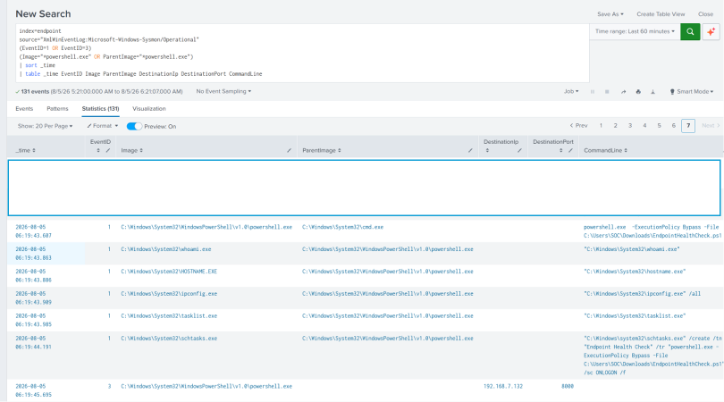

# Endpoint Intrusion Detection

> A hands-on SOC investigation that simulates a realistic endpoint compromise and demonstrates how attacker activity can be detected, investigated, and reconstructed using Splunk Enterprise and Sysmon.

---

# Overview

This project demonstrates a complete endpoint intrusion investigation performed within a controlled virtual lab environment. The objective was to simulate a realistic attack against a Windows endpoint and investigate the resulting telemetry from the perspective of a Security Operations Center (SOC) analyst.

Throughout the investigation, endpoint telemetry generated by Sysmon was collected through Splunk Universal Forwarder and analyzed using Splunk Enterprise. By correlating process creation events, network connections, and Windows system activity, the attack was reconstructed across each stage of the Cyber Kill Chain and mapped to the MITRE ATT&CK framework.

Rather than focusing on offensive techniques, this project emphasizes detection engineering, incident investigation, and the analytical process used by SOC analysts to identify and understand suspicious endpoint activity.

---

# Attack Scenario

The organization performs routine endpoint maintenance using a trusted PowerShell script named **EndpointHealthCheck.ps1**, distributed through an internal IT repository.

An attacker gains unauthorized access to the repository and modifies the trusted script before it is distributed to employees. The modified script preserves its original functionality to avoid suspicion while introducing additional commands that perform endpoint discovery, establish persistence, and initiate a simulated outbound HTTP connection.

During a scheduled maintenance cycle, an employee receives an internal IT notification requesting execution of the updated endpoint health check. Trusting the source, the employee downloads and executes the modified script.

Following execution, the script gathers basic system information, creates a Scheduled Task to maintain persistence, and communicates with a simulated attacker-controlled web server. These actions generate Windows endpoint telemetry that is collected by Sysmon and forwarded to Splunk Enterprise for investigation.

From the SOC analyst's perspective, the investigation begins with a suspicious PowerShell execution alert. By correlating process creation events, child processes, persistence mechanisms, and outbound network activity, the analyst reconstructs the complete attack timeline and maps the observed behavior to the MITRE ATT&CK framework.

The attacker's objective is not immediate disruption or data theft, but to establish an initial foothold, collect reconnaissance information about the compromised endpoint, maintain persistence, and verify communication with the host in preparation for potential future operations.

# Phase 1 – Reconnaissance

## Objective

Identify exposed services on the target endpoint to gather information that could support later stages of the attack.

---

## Description

Reconnaissance is the first stage of the Cyber Kill Chain, where an attacker collects information about the target before attempting exploitation. In this scenario, the attacker performed active network scanning to identify exposed services on the Windows endpoint and determine whether it was a suitable target.

---

## Attack Activity

The attacker used **Nmap** to perform a TCP SYN scan with service version detection.

### Command

```bash
nmap -sS -sV <Victim-IP>
```

### Why was this command used?

| Option | Description |
|---------|-------------|
| `-sS` | Performs a TCP SYN (half-open) scan, which is a fast and commonly used reconnaissance technique to identify open ports without completing the full TCP handshake. |
| `-sV` | Attempts to identify the service and version running on each open port. This helps the attacker understand the target environment. |

### Scan Results

The scan identified the following Windows services:

| Port | Service | Description |
|------|----------|-------------|
| 135 | RPC | Remote Procedure Call service used by Windows. |
| 139 | NetBIOS | Network file and printer sharing service. |
| 445 | SMB | Server Message Block used for Windows file sharing and remote administration. |

---

## SOC Investigation

### Investigation Question

> **Was the endpoint targeted by reconnaissance activity?**

To answer this question, Windows Firewall logs were reviewed in Splunk Enterprise to identify inbound connection attempts targeting common Windows services.

### SPL Query

```spl
index=endpoint
sourcetype=windows:firewall
RECEIVE
(" 135 " OR " 139 " OR " 445 ")
| table _time _raw
```

### Why was this query used?

| Query Component | Purpose |
|-----------------|---------|
| `index=endpoint` | Searches the index containing endpoint logs. |
| `sourcetype=windows:firewall` | Limits results to Windows Firewall events. |
| `RECEIVE` | Displays inbound network connections received by the endpoint. |
| `("135" OR "139" OR "445")` | Filters events targeting the Windows services identified during reconnaissance. |
| `table _time _raw` | Displays the event timestamp and the complete firewall log for analysis. |

---

## Findings

The investigation identified multiple inbound connection attempts targeting ports **135**, **139**, and **445** from the same source host.

This activity is consistent with active network reconnaissance, where an attacker probes a target to identify exposed services before attempting further compromise. Although no exploitation occurred during this phase, the information gathered enabled the attacker to prepare the next stage of the intrusion.

---

## MITRE ATT&CK Mapping

| Tactic | Technique | ID |
|---------|-----------|----|
| Reconnaissance | Active Scanning | T1595 |

---

## Evidence

### Image 1 – Nmap Scan

<p align="center">

</p>

*Figure 1. Nmap TCP SYN scan identifying exposed services on the Windows endpoint.*

---

### Image 2 – Splunk Investigation

<p align="center">

</p>

*Figure 2. Windows Firewall logs reviewed in Splunk showing inbound connections associated with reconnaissance activity.*

---

## SOC Analyst Conclusion

Based on the available evidence, the endpoint was subjected to active service enumeration. The attacker successfully identified exposed Windows services that could be leveraged during subsequent phases of the attack. While no malicious execution occurred during reconnaissance, this activity established the foundation for the weaponization and delivery stages that followed.

# Phase 2 – Weaponization

## Objective

Prepare a malicious payload capable of compromising the target while appearing as a legitimate administrative tool.

---

## Description

During the weaponization phase, the attacker prepares the payload that will later be delivered to the victim. Instead of creating an obviously malicious program, the attacker compromises a trusted PowerShell maintenance script already used within the organization.

The legitimate script, **EndpointHealthCheck.ps1**, is modified to preserve its original functionality while incorporating additional commands that perform endpoint discovery, establish persistence, and simulate outbound communication.

By embedding malicious functionality into a trusted script, the attacker increases the likelihood that the payload will be executed without raising suspicion.

---

## Attack Activity

The attacker modified the organization's trusted **EndpointHealthCheck.ps1** script by adding commands to:

- Collect the current user information (`whoami`)
- Retrieve the computer name (`hostname`)
- Enumerate network configuration (`ipconfig /all`)
- List running processes (`tasklist`)
- Create a Scheduled Task for persistence (`schtasks`)
- Initiate a simulated HTTP request to an attacker-controlled server

The original administrative functionality of the script remained intact to maintain legitimacy.

---

## Why modify a trusted script?

Attackers often abuse trusted administrative scripts because:

- Employees are more likely to trust and execute them.
- Security tools may be less suspicious of legitimate administrative utilities.
- The script blends into normal IT operations.
- Minimal modifications can provide significant attacker capabilities while remaining difficult to detect.

This technique demonstrates how attackers can leverage trusted resources rather than relying on traditional malware.

---

## SOC Investigation

### Investigation Question

> **How did the attacker prepare the payload before it reached the victim?**

During this phase, no endpoint telemetry is available because the script has not yet been executed. Therefore, the SOC analyst cannot directly observe the weaponization process through Sysmon or Splunk.

Instead, evidence of weaponization is inferred during later phases by examining:

- The PowerShell command line
- Child processes spawned by the script
- Persistence mechanisms
- Network connections
- The script contents during forensic analysis

---

## Findings

The attacker successfully transformed a legitimate administrative script into a malicious payload while preserving its intended functionality.

From a defender's perspective, the script appeared to be a routine IT maintenance tool, increasing the likelihood that it would be executed by the victim.

---

## MITRE ATT&CK Mapping

| Tactic | Technique | ID |
|---------|-----------|----|
| Execution | PowerShell | T1059.001 |

> **Note:** Weaponization itself is not represented as a standalone MITRE ATT&CK tactic. Instead, the techniques introduced during this phase are mapped to the tactics they enable, such as Execution, Persistence, Discovery, and Command and Control.

---

## Evidence

### Image 3 – Original EndpointHealthCheck.ps1

<p align="center">

</p>

*Figure 3. The original PowerShell health check script used by the organization's IT department.*

---

### Image 4 – Modified EndpointHealthCheck.ps1

<p align="center">

</p>

*Figure 4. The modified PowerShell script containing additional commands used to perform discovery, establish persistence, and simulate outbound communication.*

---

## SOC Analyst Conclusion

The investigation determined that the attacker weaponized a trusted PowerShell maintenance script rather than introducing a standalone malicious executable. By embedding additional functionality into an existing administrative tool, the attacker increased the likelihood of successful execution while reducing suspicion. Although the weaponization process itself generated no endpoint telemetry, its effects became evident during subsequent execution and persistence stages of the investigation.


# Phase 3 – Delivery

## Objective

Deliver the weaponized PowerShell script to the target through a trusted communication channel, increasing the likelihood that the victim will execute the payload.

---

## Description

The delivery phase focuses on transferring the prepared payload to the target system. Rather than exploiting a software vulnerability, the attacker relied on social engineering by impersonating the organization's IT department.

A convincing  email was created to resemble a routine IT notification requesting employees to perform a scheduled endpoint health check. The email contained a link directing the victim to download the latest version of the **EndpointHealthCheck.ps1** script from what appeared to be the organization's internal repository.

Within the lab environment, the repository was simulated using Python's built-in HTTP server hosted on the Kali Linux attacker machine. Trusting the legitimacy of the request, the victim downloaded the modified PowerShell script.

---

## Attack Activity

The attacker hosted the modified PowerShell script using Python's built-in HTTP server.

### Command

```bash
python3 -m http.server 8000
```

### Why was this command used?

| Option | Description |
|---------|-------------|
| `python3` | Launches the Python interpreter. |
| `-m http.server` | Starts Python's lightweight HTTP server module. |
| `8000` | Specifies the listening port used to host the repository. |

This command provided a simple web server that simulated an internal IT file repository from which the victim downloaded the modified PowerShell script.

---

## Delivery Process

1. The attacker hosted the modified `EndpointHealthCheck.ps1` script on the simulated repository.
2. The victim received a trusted-looking HTML email requesting completion of the monthly endpoint health check.
3. The victim followed the provided link.
4. The modified PowerShell script was successfully downloaded from the attacker's web server.

---

## SOC Investigation

### Investigation Question

> **Was the malicious PowerShell script successfully delivered to the victim?**

Unlike later stages of the attack, the delivery phase generated minimal endpoint telemetry because the script had not yet been executed. Therefore, evidence of successful delivery was obtained from the web server logs.

The Python HTTP server recorded every request made by the victim, allowing the analyst to verify whether the payload had been downloaded successfully.

---

## Findings

The web server logs confirmed that the victim successfully requested and downloaded **EndpointHealthCheck.ps1**, indicated by the HTTP **200 OK** response.

This confirms that the payload was successfully transferred to the victim's workstation and was available for execution during the next phase of the attack.

---

## MITRE ATT&CK Mapping

| Tactic | Technique | ID |
|---------|-----------|----|
| Initial Access | Phishing | T1566 |
| Initial Access | Spearphishing Link | T1566.002 |

> **Note:** The phishing email and internal repository are simulated within the lab environment to demonstrate the delivery stage of the Cyber Kill Chain.

---

## Evidence

### Image 5 – Simulated Internal IT Email

<p align="center">

</p>

*Figure 5. Simulated internal IT email instructing the employee to download the latest endpoint health check script.*

---

### Image 6 – Python HTTP Server

<p align="center">

</p>

*Figure 6. Python HTTP server hosting the modified `EndpointHealthCheck.ps1` script.*

---

### Image 7 – Successful Script Download

<p align="center">

</p>

*Figure 7. Web server logs confirming that the victim successfully downloaded `EndpointHealthCheck.ps1` (HTTP 200 OK).*

---

## SOC Analyst Conclusion

The delivery phase was successful. Analysis of the web server logs confirmed that the victim downloaded the modified PowerShell script from the simulated internal repository. By delivering the payload through a trusted IT communication channel, the attacker increased the likelihood of successful execution, enabling the attack to progress to the execution phase.

# Phase 4 – Exploitation

## Objective

Determine whether the delivered PowerShell script was successfully executed on the target endpoint and reconstruct the initial execution activity using endpoint telemetry.

---

## Description

The exploitation phase begins when the victim executes the delivered payload, allowing the attacker to gain code execution on the target endpoint.

In this simulated scenario, the employee received a phishing email impersonating the organization's IT department. The email instructed employees to download the latest version of **EndpointHealthCheck.ps1** and execute it from **Command Prompt** as part of a scheduled endpoint health check. Believing the request to be legitimate, the employee followed the provided instructions and executed the following command:

```powershell
powershell.exe -ExecutionPolicy Bypass -File C:\Users\SOC\Downloads\EndpointHealthCheck.ps1
```

Although the script appeared to be a trusted administrative tool, it had been modified during the weaponization phase to include malicious functionality while preserving its original behavior. Once executed, the script initiated attacker-controlled actions and generated Windows process creation events recorded by Sysmon.

From the SOC analyst's perspective, the first objective was to determine whether the downloaded script had been executed and identify the process responsible for launching it. By analyzing Sysmon Process Creation events, the analyst reconstructed the execution chain and confirmed that the attack had progressed beyond the delivery phase.

This phase represents the initial compromise of the endpoint and provides the first observable evidence of malicious activity within the environment.

---

# SOC Investigation

After confirming that the payload had been delivered, the next objective was to determine whether it had been executed and reconstruct the initial execution activity.

The investigation was conducted in three stages.

---

## Investigation 1 – Find the Suspicious PowerShell Process

### Investigation Question

> **Was the downloaded PowerShell script executed on the endpoint?**

The investigation began by reviewing Sysmon Process Creation events to identify PowerShell executions. Since the environment uses Splunk Universal Forwarder, background PowerShell processes generated by Splunk were excluded to reduce noise.

### SPL Query

```spl
index=endpoint
source="XmlWinEventLog:Microsoft-Windows-Sysmon/Operational"
EventID=1
Image="*powershell.exe"
NOT Image="*splunk-powershell.exe"
| sort -_time
| table _time Computer User ParentImage Image CommandLine
```

### Why was this query used?

| Query Component | Purpose |
|-----------------|---------|
| `EventID=1` | Retrieves Sysmon Process Creation events. |
| `Image="*powershell.exe"` | Searches for PowerShell executions. |
| `NOT Image="*splunk-powershell.exe"` | Excludes PowerShell processes generated by Splunk Universal Forwarder. |
| `ParentImage` | Identifies which process launched PowerShell. |
| `CommandLine` | Displays the exact execution command. |
| `User` | Identifies the account that executed the process. |

### Findings

The investigation identified the following PowerShell command:

```text
powershell.exe -ExecutionPolicy Bypass -File
C:\Users\SOC\Downloads\EndpointHealthCheck.ps1
```

The command line confirmed that the downloaded **EndpointHealthCheck.ps1** script was executed from the user's **Downloads** directory.

Based on the simulated attack scenario, the employee executed this command after following instructions contained in a phishing email impersonating the organization's IT department. The email instructed employees to perform a routine endpoint health check by executing the downloaded PowerShell script.

The **ExecutionPolicy Bypass** parameter temporarily bypassed the local PowerShell execution policy, allowing the modified script to execute successfully.

---

### Evidence

<p align="center">

</p>

*Figure 8. Suspicious PowerShell execution identified in Sysmon Process Creation events.*

---

## Investigation 2 – Investigate the Parent Process

### Investigation Question

> **Which process launched PowerShell?**

Understanding the parent process helps reconstruct how the script was executed and validate the attack sequence.

### SPL Query

```spl
index=endpoint
source="XmlWinEventLog:Microsoft-Windows-Sysmon/Operational"
EventID=1
(Image="*cmd.exe" OR Image="*explorer.exe")
| sort -_time
| table _time Image ParentImage CommandLine
```

### Why was this query used?

| Query Component | Purpose |
|-----------------|---------|
| `EventID=1` | Retrieves Process Creation events. |
| `Image="*cmd.exe"` | Searches for Command Prompt executions. |
| `Image="*explorer.exe"` | Includes Windows Explorer processes that may launch applications. |
| `ParentImage` | Displays the parent-child relationship between processes. |
| `CommandLine` | Shows how the parent process was executed. |

### Findings

The investigation showed that **cmd.exe** launched **powershell.exe**.

This finding is consistent with the simulated attack scenario, where the employee followed the instructions in the phishing email and executed the provided PowerShell command from **Command Prompt**. Establishing this parent-child relationship allowed the SOC analyst to reconstruct how the attack progressed from payload delivery to successful code execution.

---

### Evidence

<p align="center">

</p>

*Figure 9. Process creation events showing **cmd.exe** launching **powershell.exe**.*

---

## SOC Analyst Conclusion

The investigation confirmed that the modified **EndpointHealthCheck.ps1** script was successfully executed after the employee followed what appeared to be a legitimate IT maintenance request. Analysis of Sysmon Process Creation events confirmed the PowerShell execution, identified the parent process responsible for launching it, and established the point at which the attacker gained code execution on the endpoint.

---

# Phase 5 – Installation

## Objective

Determine whether the attacker established a persistence mechanism on the compromised endpoint that would allow the malicious PowerShell script to execute automatically after the initial compromise.

---

## Description

Following successful exploitation, attackers commonly establish persistence to maintain access to a compromised system. Instead of relying on the victim to execute the payload repeatedly, the attacker configures the operating system to automatically launch the malicious payload whenever a predefined event occurs.

In this scenario, the already-running **EndpointHealthCheck.ps1** script invoked **schtasks.exe** to create a Windows Scheduled Task named **Endpoint Health Check**. The task was configured to execute the PowerShell script automatically whenever the user logged on.

Unlike the exploitation phase, the victim did **not** execute the PowerShell command again. Instead, the PowerShell script created a Scheduled Task that stored the command and instructed Windows Task Scheduler to execute it automatically during future logon events.

From the SOC analyst's perspective, the objective was to determine whether the PowerShell process established any persistence mechanism after execution. By investigating Sysmon Process Creation events, the analyst identified **schtasks.exe** being launched by **powershell.exe**, confirming that the attacker had installed a Scheduled Task to maintain access.

---

# SOC Investigation

## Investigation Question

> **Did the attacker establish persistence on the endpoint?**

To answer this question, Sysmon Process Creation events were searched for executions of **schtasks.exe**, the native Windows utility used to create and manage Scheduled Tasks.

### SPL Query

```spl
index=endpoint
source="XmlWinEventLog:Microsoft-Windows-Sysmon/Operational"
EventID=1
Image="*schtasks.exe"
| table _time Image ParentImage CommandLine
```

### Why was this query used?

| Query Component | Purpose |
|-----------------|---------|
| `EventID=1` | Retrieves Sysmon Process Creation events. |
| `Image="*schtasks.exe"` | Identifies executions of the Windows Scheduled Task utility. |
| `ParentImage` | Determines which process launched schtasks.exe. |
| `CommandLine` | Displays the exact command used to create the Scheduled Task. |

---

## Findings

The investigation identified **schtasks.exe** being executed by **powershell.exe**, indicating that the already-running PowerShell script attempted to establish persistence.

The command line showed that the Scheduled Task was created using the following options:

| Option | Description |
|---------|-------------|
| `/Create` | Creates a new Scheduled Task. |
| `/SC ONLOGON` | Configures the task to execute whenever a user logs on. |
| `/TN "Endpoint Health Check"` | Specifies the Scheduled Task name. |
| `/TR` | Defines the command that Windows Task Scheduler will execute. |

The task stored the following command:

```text
powershell.exe -ExecutionPolicy Bypass -File
C:\Users\SOC\Downloads\EndpointHealthCheck.ps1
```

This command was **not executed during the installation phase**. Instead, it was saved as the action associated with the Scheduled Task. Windows Task Scheduler will automatically execute this command the next time a user logs on, allowing the modified PowerShell script to run again without requiring the victim to manually execute it.

This confirmed that the attacker successfully established persistence on the compromised endpoint.

---

## Evidence

<p align="center">

</p>

*Figure 11. Sysmon Process Creation event showing **schtasks.exe** creating the Scheduled Task used for persistence.*

---

## MITRE ATT&CK Mapping

| Tactic | Technique | ID |
|---------|-----------|----|
| Persistence | Scheduled Task/Job | T1053.005 |

---

## SOC Analyst Conclusion

The investigation confirmed that the attacker established persistence by creating a Windows Scheduled Task through **schtasks.exe**. Rather than requiring the victim to execute the PowerShell script again, the attacker configured Windows Task Scheduler to automatically launch the stored PowerShell command during future user logon events, ensuring continued execution of the malicious script after the initial compromise.

# Phase 6 – Command and Control (C2)

## Objective

Determine whether the compromised endpoint established outbound communication with attacker-controlled infrastructure following successful installation of the persistence mechanism.

---

## Description

Following successful exploitation and installation, attackers typically establish communication with external infrastructure to verify that the compromise was successful and to enable future interaction with the compromised endpoint. This communication channel, commonly referred to as **Command and Control (C2)**, allows attackers to exchange information, issue commands, download additional payloads, or exfiltrate collected data.

In this lab, command-and-control activity was simulated using a Python HTTP server running on the Kali Linux attacker machine. Rather than implementing a complete C2 framework, the modified PowerShell script generated an outbound HTTP request to the simulated attacker server after execution.

From the SOC analyst's perspective, the objective was to determine whether the suspicious PowerShell process initiated any outbound network connections following execution. Using Sysmon Network Connection events (Event ID 3), the analyst reconstructed the communication between the compromised endpoint and the simulated attacker infrastructure.

---

# SOC Investigation

## Investigation Question

> **Did the compromised endpoint communicate with an external server?**

The investigation focused on Sysmon Network Connection events generated by PowerShell.

### SPL Query

```spl
index=endpoint
source="XmlWinEventLog:Microsoft-Windows-Sysmon/Operational"
EventID=3
Image="*powershell.exe"
| table _time Image DestinationIp DestinationHostname DestinationPort Protocol
```

### Why was this query used?

| Query Component | Purpose |
|-----------------|---------|
| `EventID=3` | Retrieves Sysmon Network Connection events. |
| `Image="*powershell.exe"` | Filters network activity initiated by PowerShell. |
| `DestinationIp` | Displays the destination IP address. |
| `DestinationHostname` | Displays the remote hostname when available. |
| `DestinationPort` | Identifies the destination service. |
| `Protocol` | Displays the communication protocol. |

---

## Findings

The investigation identified an outbound network connection initiated by **powershell.exe**.

The connection was established to the simulated attacker server:

- **Destination IP:** `192.168.7.132`
- **Destination Port:** `8000`
- **Protocol:** TCP

The destination matched the Python HTTP server previously used to host the modified PowerShell script. This confirmed that the compromised endpoint successfully communicated with the attacker-controlled infrastructure after execution.

Although simplified for the purpose of this lab, the observed behavior resembles the initial beacon commonly seen during the early stages of command-and-control activity.

---

## Evidence

### Figure 12 – Outbound Network Connection

<p align="center">

</p>

*Figure 12. Sysmon Event ID 3 showing PowerShell initiating an outbound TCP connection to the simulated attacker server.*

---

## MITRE ATT&CK Mapping

| Tactic | Technique | ID |
|---------|-----------|----|
| Command and Control | Application Layer Protocol: Web Protocols | T1071.001 |

---

## SOC Analyst Conclusion

The investigation confirmed that the PowerShell process established outbound communication with the simulated attacker-controlled server. Correlating the network connection with the earlier execution events demonstrated that the attack had progressed beyond installation and entered the Command and Control phase of the Cyber Kill Chain.

# Phase 7 – Actions on Objectives

## Objective

Determine the attacker's final objective after successfully compromising the endpoint by reconstructing the post-exploitation activities performed on the victim system.

---

## Description

The **Actions on Objectives** phase represents the final stage of the Cyber Kill Chain, where the attacker performs activities to achieve the intended objective after successfully compromising the target endpoint.

In this simulated scenario, the modified **EndpointHealthCheck.ps1** script executed several legitimate Windows utilities to perform endpoint discovery. These commands collected information about the compromised system, including the current user, computer name, network configuration, and running processes.

From the SOC analyst's perspective, the objective was to determine the attacker's post-exploitation activities by correlating endpoint telemetry generated throughout the intrusion. Rather than analyzing individual events in isolation, multiple Sysmon events were correlated to reconstruct the complete attack timeline, beginning with PowerShell execution and continuing through persistence, outbound communication, and endpoint discovery.

This phase demonstrates how endpoint telemetry can be correlated to identify an attacker's objectives and reconstruct the final stage of an intrusion.

---

# SOC Investigation

## Investigation Question

> **What actions did the attacker perform after successfully compromising the endpoint?**

To answer this question, Sysmon **Process Creation (Event ID 1)** and **Network Connection (Event ID 3)** events were correlated to reconstruct the complete attack timeline generated by the malicious PowerShell script.

---

## SPL Query

```spl
index=endpoint
source="XmlWinEventLog:Microsoft-Windows-Sysmon/Operational"
(EventID=1 OR EventID=3)
(Image="*powershell.exe" OR ParentImage="*powershell.exe")
| sort _time
| table _time EventID Image ParentImage DestinationIp DestinationPort CommandLine
```

---

## Why was this query used?

| Query Component | Purpose |
|-----------------|---------|
| `EventID=1 OR EventID=3` | Retrieves both Process Creation and Network Connection events. |
| `Image="*powershell.exe"` | Identifies PowerShell execution and outbound network connections initiated by PowerShell. |
| `ParentImage="*powershell.exe"` | Returns child processes created by PowerShell. |
| `DestinationIp` | Displays the remote IP address contacted by PowerShell. |
| `DestinationPort` | Displays the destination service. |
| `CommandLine` | Shows the exact command executed by each process. |
| `sort _time` | Reconstructs the attack timeline in chronological order. |

---

## Findings

By correlating Sysmon **Process Creation (Event ID 1)** and **Network Connection (Event ID 3)** events, the SOC analyst reconstructed the complete sequence of attacker activity performed after the modified PowerShell script was executed.

The investigation identified the following sequence:

1. **PowerShell** executed the modified **EndpointHealthCheck.ps1** script.
2. The script launched the following endpoint discovery commands:
   - `whoami.exe`
   - `hostname.exe`
   - `ipconfig.exe /all`
   - `tasklist.exe`
3. The script established persistence by creating the **Endpoint Health Check** Scheduled Task.
4. PowerShell initiated an outbound HTTP connection to the simulated attacker-controlled server (**192.168.7.132:8000**).

Correlating these events demonstrated that the attacker successfully progressed from code execution to persistence, outbound communication, and endpoint discovery. Together, these activities represent the attacker's objective after compromising the endpoint.

---

## Evidence

<p align="center">

</p>

**Figure 13.** Correlated Sysmon Process Creation (Event ID 1) and Network Connection (Event ID 3) events reconstructing the attack timeline from PowerShell execution through persistence, outbound communication, and endpoint discovery.

---

## MITRE ATT&CK Mapping

| Tactic | Technique | ID |
|---------|-----------|----|
| Discovery | System Owner/User Discovery | T1033 |
| Discovery | System Information Discovery | T1082 |
| Discovery | System Network Configuration Discovery | T1016 |
| Discovery | Process Discovery | T1057 |
| Persistence | Scheduled Task/Job | T1053.005 |
| Command and Control | Application Layer Protocol: Web Protocols | T1071.001 |

---

## SOC Analyst Conclusion

The investigation confirmed that the attacker successfully achieved the objectives of the simulated intrusion by performing endpoint discovery after gaining code execution on the target system. By correlating Sysmon Process Creation and Network Connection events, the SOC analyst reconstructed the complete post-exploitation timeline, demonstrating how the attacker established persistence, communicated with the simulated command-and-control server, and collected information about the compromised endpoint.

---

# Investigation Summary

The following infographic summarizes the complete attack lifecycle reconstructed during the investigation using the **Cyber Kill Chain** methodology. It highlights the attacker's progression from reconnaissance through the final objectives and the key evidence identified during each phase.

<p align="center">

</p>

**Figure 14.** Cyber Kill Chain investigation summary illustrating the complete endpoint intrusion lifecycle. The attacker performed reconnaissance using **Nmap** from **192.168.7.132**, weaponized the legitimate **EndpointHealthCheck.ps1** script by embedding malicious functionality, delivered it through a phishing email, executed the modified script via PowerShell, established persistence using the **Endpoint Health Check** Scheduled Task, initiated outbound HTTP communication to **192.168.7.132:8000**, and concluded the intrusion by performing endpoint discovery using native Windows utilities.

---

# Final SOC Assessment

This investigation successfully reconstructed the complete endpoint intrusion by correlating endpoint telemetry collected by **Sysmon** and analyzed using **Splunk Enterprise**.

The investigation validated every stage of the Cyber Kill Chain, beginning with reconnaissance and continuing through weaponization, delivery, exploitation, installation, command and control, and actions on objectives. By correlating Process Creation and Network Connection events, the SOC analyst reconstructed the complete attack timeline and identified the techniques used to gain execution, establish persistence, communicate with external infrastructure, and perform endpoint discovery.

This project demonstrates a structured SOC investigation workflow that combines endpoint telemetry, log correlation, the Cyber Kill Chain, and the MITRE ATT&CK framework to analyze and reconstruct a multi-stage endpoint intrusion.


