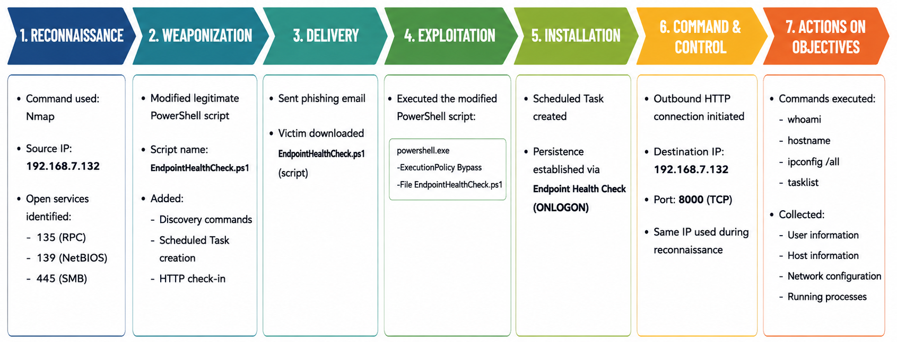

# SOC Lab

**Author:** Shahad 

A hands-on Security Operations Center (SOC) laboratory focused on attack simulation, threat detection, incident investigation, and detection engineering.

This repository documents practical SOC projects built in a controlled virtual environment. Each project simulates realistic attack scenarios and demonstrates how security events can be detected, investigated, and mapped to industry frameworks such as the MITRE ATT&CK framework and the Cyber Kill Chain.

---

## Objectives

- Build realistic SOC investigation scenarios
- Develop detection rules using Splunk SPL
- Analyze Windows endpoint telemetry
- Practice incident response and threat hunting
- Map attacker behavior to MITRE ATT&CK
- Improve blue team investigation skills

---

## Lab Environment

| Component | Technology |
|----------|------------|
| Hypervisor | VMware Workstation |
| Attacker Machine | Kali Linux |
| Victim Machine | Windows 10 |
| SIEM | Splunk Enterprise |
| Log Forwarder | Splunk Universal Forwarder |
| Endpoint Telemetry | Sysmon |
| Web Server | Python HTTP Server |
| Network | VMware NAT Network |

---

## Tools & Technologies

- Splunk Enterprise
- Splunk Universal Forwarder
- Sysmon
- Kali Linux
- Windows 10
- PowerShell
- Python HTTP Server
- Nmap
- MITRE ATT&CK Framework
- Cyber Kill Chain

---

## Projects

### 🛡️ Endpoint Intrusion Detection

A hands-on SOC investigation that simulates a realistic endpoint compromise using a phishing-delivered PowerShell script. The project demonstrates how endpoint telemetry collected by **Sysmon** and analyzed in **Splunk Enterprise** can be used to reconstruct the complete attack lifecycle using the **Cyber Kill Chain** and **MITRE ATT&CK** framework.

*Cyber Kill Chain investigation summary of the simulated endpoint intrusion.*

**Project Highlights**

- Simulated attacker infrastructure using **Kali Linux**
- Investigated Windows endpoint telemetry using **Sysmon**
- Correlated **Process Creation** and **Network Connection** events in Splunk
- Reconstructed all seven Cyber Kill Chain phases
- Mapped attacker techniques to the **MITRE ATT&CK** framework
- Documented the complete SOC investigation process

📂 **Project Folder:** [Endpoint-Intrusion-Detection](./Endpoint-Intrusion-Detection)

---

More SOC investigations will be added over time.

## Skills Demonstrated

- Security Monitoring
- Threat Hunting
- Incident Investigation
- Windows Event Log Analysis
- Sysmon Analysis
- Splunk Search Processing Language (SPL)
- Endpoint Detection
- MITRE ATT&CK Mapping
- Cyber Kill Chain Analysis
- Detection Engineering

---

## Disclaimer

All projects in this repository were developed in an isolated virtual lab environment for educational purposes only. The attack simulations are non-destructive and are designed to generate realistic telemetry for defensive analysis and SOC investigations.
